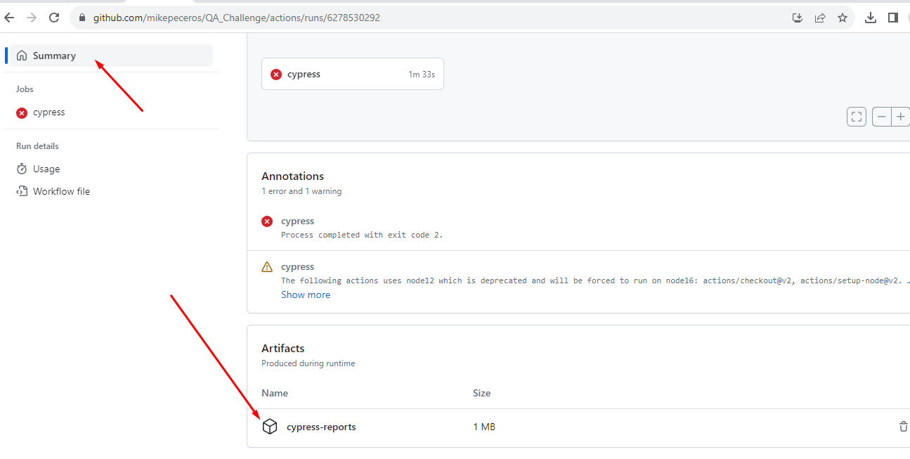
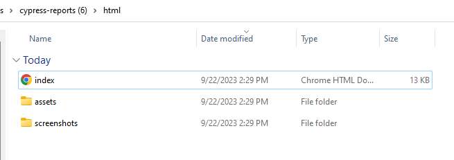

# QA Challenge

Project for QA challenge

Notes:

- Githubactions shares the report of the test run in Summary, just download and open the html file4

Libs and Tools:

- Any browser automation tool (Selenium / Playwright / Cypress)
- Any API automation tool (RestAssured / Playwright / Cypress)
- Reporting Tool

## 🎯 UI Automation Test

Open [website](https://www.pokemon.com/us/) and create a test script for the following:

Scenario 1 - Navigate to the Pokedex and create an account  
Scenario 2 - Create a new scenario that you wish to add   

## 🎯 API Automation Test 

Using [this Pokemon API](https://pokeapi.co/), create tests for the following scenarios:

Task 1 - Create a scenario and check the status code  
Task 2 - Create a scenario and check data results 
Task 3 - Create a new scenario that you wish to add  

## :rotating_light: What should the project consist of? 

- The project should be configurable to CI/CD  
- In the final run of all tests, a collective summary of results on a Reporting Dashboard  

## :rotating_light: Steps for QA

The candidate will need to:
1. Fork the project  
2. Commit their updates to their fork  
3. Send a PR for this repository (including .yml file)  
4. Include a link to Public Reporting Tool
